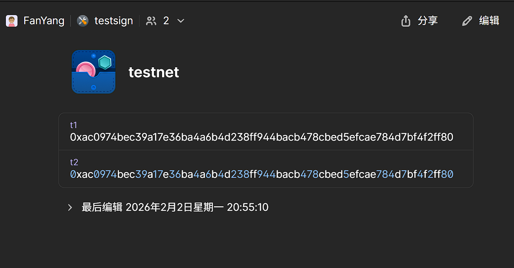

# How to use the Signer by Vault

## Configuration

The Signer by Vault use path to select the address to sign.

the path like:

```
http://127.0.0.1:8545/op/vaults/testsign/items/testnet/t2
```

the `http://127.0.0.1:8545` is the rpc endpoint, and `/op/vaults/testsign/items/testnet/t2` is the path to select the address to sign.

The path is composed of the following parts:

- `/op/vaults/testsign`: the vault name, note the `op/vaults` is the onepassword 's plugin path, and the `testsign` is the vault name in onepassword.
- `/items/testnet` is the item name, and `/t2` is the item path.

for this example, we can see in onepassword:



t1 and t2 is a private key item, we can use alt_publickey to get the public key:

```bash
curl -X POST http://127.0.0.1:8545/op/vaults/testsign/items/testnet/t2 \
  -H "Content-Type: application/json" \
  -d '{
    "jsonrpc": "2.0",
    "method": "alt_publickey",
    "params": [],
    "id": 1
  }'
{"jsonrpc":"2.0","id":1,"result":"0xf39fd6e51aad88f6f4ce6ab8827279cfffb92266"}
```

For easy use, we can use prefix:

- `OP_SIGNER_VAULT_ROOT_PATH_PREFIX` is the prefix of the path

when use this, for example `OP_SIGNER_VAULT_ROOT_PATH_PREFIX="op/vaults/testsign/items"`, the path will be:

```bash
curl -X POST http://127.0.0.1:8545/testnet/t2 \
  -H "Content-Type: application/json" \
  -d '{
    "jsonrpc": "2.0",
    "method": "alt_publickey",
    "params": [],
    "id": 1
  }'
{"jsonrpc":"2.0","id":1,"result":"0xf39fd6e51aad88f6f4ce6ab8827279cfffb92266"}
```

## Usage

For example, we can use the signer by vault to sign a transaction:

```bash
    --signer.address value                                                 ($OP_BATCHER_SIGNER_ADDRESS)
          Address the signer is signing requests for

    --signer.endpoint value                                                ($OP_BATCHER_SIGNER_ENDPOINT)
          Signer endpoint the client will connect to
```


Boot the signer:

```
OP_SIGNER_VAULT_ROOT_PATH_PREFIX='op/vaults/testsign/items' OP_SIGNER_VAULT_TOKEN='root' OP_SIGNER_VAULT_ADDR='http://127.0.0.1:8200' ./bin/op-signer  --rpc.port 18545  --tls.enabled=false --config ./config.local.yaml --log.level debug
```

for cofig:

```
auth:
provider: VAULT1PASS
```

also we can use op-signer 's config to make more safy config:

```json
{
  "provider": "VAULT1PASS",
  "auth": [
    {
      "name": "op/vaults/testsign/items/testnet/batcher-private",
      "key": "op/vaults/testsign/items/testnet/batcher-private",
      "chainID": 1,
      "fromAddress": "0xd3f2c5afb2d76f5579f326b0cd7da5f5a4126c35",
      "toAddresses": [],
      "maxValue": "0x0",
      "allowed_client_cn": "localhost"
    }
  ]
}

```

Then we can set the batcher 's private key to 1pass with `batcher-private`, we can got:

```
curl -X POST http://127.0.0.1:18545/testnet/batcher-private \
  -H "Content-Type: application/json" \
  -d '{
    "jsonrpc": "2.0",
    "method": "alt_publickey",
    "params": [],
    "id": 1
  }'
{"jsonrpc":"2.0","id":1,"result":"0xd3f2c5afb2d76f5579f326b0cd7da5f5a4126c35"}
```

Then we can use the signer:

```bash
./bin/op-batcher \
    "--l2-eth-rpc=http://127.0.0.1:9700" \
    "--rollup-rpc=http://127.0.0.1:9700" \
    "--poll-interval=1s" \
    "--sub-safety-margin=6" \
    "--num-confirmations=1" \
    "--safe-abort-nonce-too-low-count=3" \
    "--resubmission-timeout=30s" \
    "--rpc.addr=0.0.0.0" \
    "--rpc.port=8548" \
    "--rpc.enable-admin" \
    "--max-channel-duration=1" \
    "--l1-eth-rpc=http://127.0.0.1:32769" \
    "--signer.address=0xd3f2c5afb2d76f5579f326b0cd7da5f5a4126c35" \
    "--signer.tls.enabled=false" \
    "--signer.endpoint=http://127.0.0.1:18545/testnet/batcher-private" \
    "--data-availability-type=blobs" \
    "--altda.enabled=false" \
    "--altda.da-server=" \
    "--altda.da-service" \
    "--metrics.enabled" \
    "--metrics.addr=0.0.0.0" \
    "--metrics.port=9001" \
    "--pprof.enabled" \
    "--pprof.addr=0.0.0.0" \
    "--pprof.port=6060"
```

```
INFO [02-03|15:29:08.058] Added L2 block to local state            block=53f295..d5f84f:3329 tx_count=1   time=1,770,103,748
INFO [02-03|15:29:09.200] Publishing transaction                   service=batcher tx=0xadf293366fdb024506ef962ccb62ef9dacb753ed6f4b66d4f57b3dfa9178784a nonce=80 gasTipCap=1,000,000,000 gasFeeCap=3,000,000,000 gasLimit=21000 blobs=1 blobFeeCap=1,000,000,000
INFO [02-03|15:29:09.200] Created channel                          id=c8a7ee..af9272 l1Head=e12988..7ba7ed:1123 blocks_pending=85  l1OriginLastSubmittedChannel=feb7e7..2da0db:1092 batch_type=0 compression_algo=zlib target_num_frames=1 max_frame_size=130,043 use_blobs=true
INFO [02-03|15:29:09.208] Transaction successfully published       service=batcher tx=0xadf293366fdb024506ef962ccb62ef9dacb753ed6f4b66d4f57b3dfa9178784a nonce=80 gasTipCap=1,000,000,000 gasFeeCap=3,000,000,000 gasLimit=21000 blobs=1 blobFeeCap=1,000,000,000 tx=adf293..78784a
INFO [02-03|15:29:09.208] Channel closed                           id=c8a7ee..af9272 blocks_pending=55  num_frames=1 input_bytes=184,091 output_bytes=119,603 oldest_l1_origin=feb7e7..2da0db:1092 l1_origin=71318b..5cdebf:1102 oldest_l2=68e542..23a5c2:3245 latest_l2=8024a5..870347:3274 full_reason="channel full: compressor is full" compr_ratio=0.650
INFO [02-03|15:29:09.209] Building Blob transaction candidate      size=119,603 last_size=119,603 num_blobs=1
INFO [02-03|15:29:10.058] Added L2 block to local state            block=927425..b58643:3330 tx_count=1   time=1,770,103,750
```

## Security

### 1. add allow path for signer

use `OP_SIGNER_VAULT_ALLOW_PATH_PREFIXES` to set the allow path for signer:

```bash
OP_SIGNER_VAULT_ALLOW_PATH_PREFIXES="op/vaults/testsign/items/testnet/batcher-private,op/vaults/testsign/items/testnet/t1"
```

then we can see the api not allow the path not in the allow paths:

```bash
curl  --cert ./tls/127.0.0.1/tls.crt --key ./tls/127.0.0.1/tls.key --cacert ./tls/ca.crt -X POST https://localhost:18545/testnet/t2  \
  -H "Content-Type: application/json" \
  -d '{
    "jsonrpc": "2.0",
    "method": "alt_publickey",
    "params": [],
    "id": 1
  }'
{"jsonrpc":"2.0","id":1,"error":{"code":-32000,"message":"GetPublicKey Failed: failed to load key 'op/vaults/testsign/items/testnet/t2': vault path is not allowed: op/vaults/testsign/items/testnet/t2"}}
```

### 2. use allowed_client_cn config

in config.yaml, we can use `allowed_client_cn` to set the allowed client cn:

```json
{
  "provider": "VAULT1PASS",
  "auth": [
    {
      "name": "op/vaults/testsign/items/testnet/batcher-private",
      "key": "op/vaults/testsign/items/testnet/batcher-private",
      "chainID": 1,
      "fromAddress": "0xd3f2c5afb2d76f5579f326b0cd7da5f5a4126c35",
      "toAddresses": [],
      "maxValue": "0x0",
      "allowed_client_cn": "localhost"
    }
  ]
}

```

when `fromAddress` is not empty, it will use `allowed_client_cn`.

also we can use admin api to add allowed client cn:

```bash
curl  --cert ./tls/127.0.0.1/tls.crt --key ./tls/127.0.0.1/tls.key --cacert ./tls/ca.crt -X POST https://localhost:9545  \
  -H "Content-Type: application/json" \
  -d '{
    "jsonrpc": "2.0",
    "method": "admin_getConfigs",
    "params": [],
    "id": 1
  }'
{"jsonrpc":"2.0","id":1,"result":{"0xD3F2c5AFb2D76f5579F326b0cD7DA5F5a4126c35":{"path":"op/vaults/testsign/items/testnet/batcher-private","parent_chain_id":1,"allowed_client_cn":"localhost"}}}
```

```bash
curl -v  --cert ./tls/127.0.0.1/tls.crt --key ./tls/127.0.0.1/tls.key --cacert ./tls/ca.crt -X POST https://localhost:9545  \
  -H "Content-Type: application/json" \
  -d '{
    "jsonrpc": "2.0",
    "method": "admin_addConfig",
    "params": ["op/vaults/testsign/items/testnet/t2", {"path":"op/vaults/testsign/items/testnet/t2"}],
    "id": 1
  }'
```

### 3. Admin API

Before deploying, generate a bcrypt hash of your API password:

```bash
cd tools
go run generate-hash.go "your-secure-password"
```


This outputs:
```
=== Bcrypt Password Hash Generated ===

Password: your-secure-password
Hash:     $2a$10$Ad4Fbf04TQLCb0gW0SvMNO8I3YDTLCQLk7M05rzCs10wcFjygit/W

Add this hash to your StatefulSet YAML:
  - name: API_PASSWORD_HASH
    value: "$2a$10$Ad4Fbf04TQLCb0gW0SvMNO8I3YDTLCQLk7M05rzCs10wcFjygit/W"
```

**Security Note:** The bcrypt hash can be safely committed to Git. It cannot be reversed to obtain the password. Only users who know the original password can authenticate to the API.

NOTE: if use export, please use `\` before `$`.

Use cmd:

```bash
./bin/op-signer admin --admin.password 123456 --admin.tls.cert ./tls/localhost/tls.crt --admin.tls.key ./tls/localhost/tls.key --admin.tls.ca ./tls/ca.crt get-configs
{
  "0x0000000000000000000000000000000000000000": {
    "path": "op/vaults/testsign/items/testnet/t1",
    "parent_chain_id": 1,
    "allowed_client_cn": "localhost"
  }
}
```

```bash
 ./bin/op-signer admin --admin.password 123456 --admin.tls.cert ./tls/localhost/tls.crt --admin.tls.key ./tls/localhost/tls.key --admin.tls.ca ./tls/ca.crt add-config --address 0xac0974bec39a17e36ba4a6b4d238ff944bacb478cbed5efcae784d7bf4f2ff80 --allowed-client-cn 111 --parent-chain-id 1 --path op/vaults/testsign/items/testnet/t2
"111"
```

```bash
./bin/op-signer admin --admin.password 123456 --admin.tls.cert ./tls/localhost/tls.crt --admin.tls.key ./tls/localhost/tls.key --admin.tls.ca ./tls/ca.crt remove-config --address 0x0000000000000000000000000000000000000000
```

## Key Reloading

When using the Vault provider, keys are cached in memory for performance. If a key is updated in Vault (e.g., rotated or changed), you need to trigger a reload to update the cached key.

### Client API: alt_reloadKey

Clients can reload their own configured key using the `alt_reloadKey` RPC method:

```bash
curl -X POST http://127.0.1:18545/testnet/batcher-private \
  -H "Content-Type: application/json" \
  -d '{
    "jsonrpc": "2.0",
    "method": "alt_reloadKey",
    "params": [],
    "id": 1
  }'
{"jsonrpc":"2.0","id":1,"result":null}
```

This will reload the key configured for the authenticated client path.

### Admin API: admin_reloadKey

Admins can reload any key by specifying the path:

```bash
curl -X POST https://localhost:9545 \
  -H "Content-Type: application/json" \
  -d '{
    "jsonrpc": "2.0",
    "method": "admin_reloadKey",
    "params": ["op/vaults/testsign/items/testnet/batcher-private"],
    "id": 1
  }'
{"jsonrpc":"2.0","id":1,"result":null}
```

Or using the CLI:

```bash
./bin/op-signer admin --admin.password 123456 --admin.tls.cert ./tls/localhost/tls.crt --admin.tls.key ./tls/localhost/tls.key --admin.tls.ca ./tls/ca.crt reload-key --path op/vaults/testsign/items/testnet/batcher-private
```

### When to Reload Keys

You should reload keys when:

1. **Key Rotation**: When a private key is rotated in Vault
2. **Key Update**: When a key's value is changed in Vault
3. **Emergency Response**: After recovering from a key compromise

### Notes

- The reload operation reads from Vault and swaps the cached key atomically, ensuring no race conditions
- If Vault is unavailable during reload, the old cached key remains usable until a successful reload
- The reload API only works with `VAULT1PASS` provider; other providers (GCP, AWS) do not cache keys
